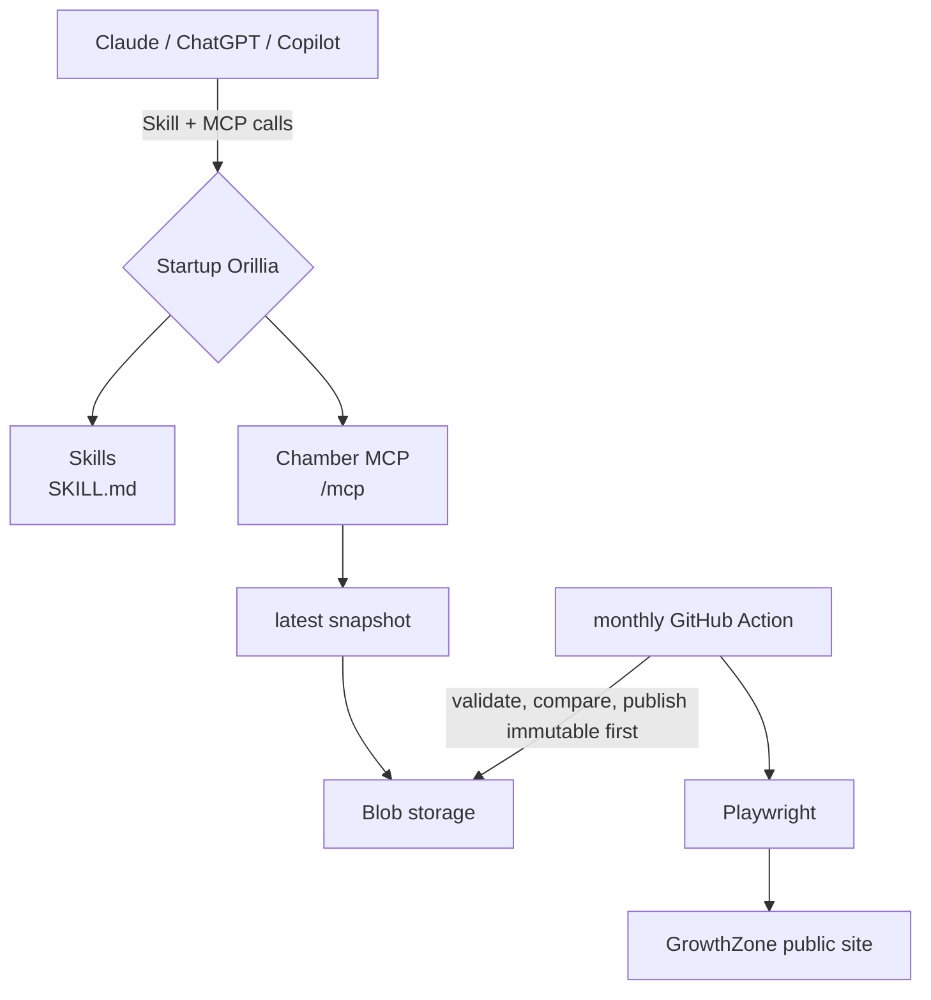

# Startup Orillia AI Skills architecture

## Decision

The existing site is a Vite 5, React 18, TypeScript single-page application deployed on Vercel. It already uses React Router, Tailwind CSS with brand tokens, Radix/shadcn-style primitives, Vercel functions, and npm. The initiative therefore remains at `startuporillia.ca/skills`, with a small Vercel Node function exposed by a rewrite at `startuporillia.ca/mcp`. No second site or framework is introduced.

The existing Neon database is used only by unrelated workshop forms. Chamber data does not use it.



## Skills

Skills live under `skills/<category>/<skill-name>/`. Each directory contains portable `SKILL.md` frontmatter (`name` and `description`) plus `skill.meta.json` for this website's catalog. The validator enforces the current Agent Skills naming/frontmatter limits, matching directory names, unique names, valid catalog metadata, semantic versions, and valid referenced files.

Commands:

```bash
npm run skills:validate
npm run skills:package
```

The website builds packages in the browser for individual downloads. The packaging command writes release ZIPs to `dist/skills/` while preserving the skill directory.

To contribute, create a focused transferable playbook, add catalog metadata, run validation and tests, and open a pull request. Skills may credit contributors but cannot be disguised advertising.

## Chamber crawler and snapshots

The crawler visits only public GrowthZone pages, uses a descriptive user agent, discovers member and event detail links, throttles navigation, and extracts semantic `itemprop` fields and stable `gz-*` classes. At the project owner's direction it does not consult `robots.txt`. It never logs in, bypasses a CAPTCHA, calls the GrowthZone API, or runs from an MCP request.

Run locally:

```bash
npm install
npx playwright install chromium
CHAMBER_SNAPSHOT_PATH=fixtures/chamber/chamber-snapshot.local.json npm run chamber:crawl
npm run chamber:validate -- fixtures/chamber/chamber-snapshot.local.json
```

Normalization trims/collapses text, canonicalizes URLs, removes tracking parameters, formats common North American phone numbers, normalizes category labels, deduplicates entities, and creates deterministic IDs from normalized source URLs. The Zod schema is in `chamber/schema.ts`.

Sanity checks reject empty snapshots, member drops greater than 25%, excessive blank names, widespread category loss, and duplicate rates over 1%. A manual workflow dispatch can explicitly override warnings for a known legitimate contraction.

Production storage uses private Vercel Blob objects, read only by the server using its Blob credential:

```text
chamber/snapshots/YYYY-MM-DDTHH-MM-SS-mmmZ.json
chamber/latest.json
```

Publishing uploads the immutable dated object first. It updates `latest.json` only after that succeeds, so crawl or publication failures leave the last good snapshot live. Historical objects are retained for audit and rollback. Logos remain source URLs.

The scheduled workflow runs at `17 11 1 * *` (approximately monthly, on the first day) and also supports `workflow_dispatch`. Manual refresh: open GitHub Actions → Refresh Chamber snapshot → Run workflow. Use the override only after reviewing an expected large source-data change.

To crawl, compare, and publish from a trusted machine instead:

```bash
CHAMBER_SNAPSHOT_PATH=/tmp/chamber-snapshot.json npm run chamber:crawl
npm run chamber:validate -- /tmp/chamber-snapshot.json /path/to/previous.json
BLOB_READ_WRITE_TOKEN=... npm run chamber:publish -- /tmp/chamber-snapshot.json
```

## MCP

The public `/skills` page is the single onboarding page, with MCP-first setup tabs, plain-language explanations and download alternatives. There is no separate connect page. Account support differs; official client instructions are linked in each tab.

`skills.list` returns the twelve playbooks' metadata and expected outputs. `skills.get` accepts a listed name and returns the canonical SKILL.md, version and source URL. These tools retrieve guidance for the host AI; they do not install skills, execute campaigns or replace the host's permissions. They work independently of the Chamber snapshot. Vercel bundles `skills/**` with the function; the validated catalog is cached per process. Skill changes therefore require a deployment, while snapshot updates do not.

Keep the skill source in this repository for v1: the website, ZIP downloads, validation and MCP all consume the same files. A separate repository is an organizational option when maintainers or release cadence diverge, not an installation requirement. The Skills CLI already discovers the nested folders in this repository.

Endpoint: `https://startuporillia.ca/mcp`

The MCP uses the official TypeScript SDK 2.x stateless per-request Streamable HTTP handler. It loads `CHAMBER_SNAPSHOT_PATH` for local/test use or `CHAMBER_SNAPSHOT_URL` in production, validates the snapshot, builds searches in memory, and caches the snapshot for six hours. Updating Blob storage does not require redeploying the site.

Tools:

- `chamber.search_members`
- `chamber.get_member`
- `chamber.list_categories`
- `chamber.search_events`
- `chamber.get_event`
- `chamber.search_benefits`
- `chamber.search_deals`
- `chamber.snapshot_status`

All are annotated read-only. Search is transparent weighted lexical/fuzzy matching across names, categories, descriptions, city, and a small plain-language synonym map. Limits are capped at 25; the default is 10. Results include snapshot freshness and source URLs.

Local function testing can use the Vercel CLI after setting:

```bash
CHAMBER_SNAPSHOT_PATH=fixtures/chamber/synthetic-snapshot.json vercel dev
```

Then connect an MCP inspector or client to `http://localhost:3000/mcp`.

## Configuration

Runtime environment variables:

- `CHAMBER_SNAPSHOT_URL`: URL for `chamber/latest.json` (required in production).
- `CHAMBER_BLOB_ACCESS`: `private` for the configured store.
- `BLOB_READ_WRITE_TOKEN`: server-only credential for reading private snapshots. Never use a `VITE_` prefix.
- `CHAMBER_SNAPSHOT_PATH`: local file path; overrides the remote URL.

GitHub Actions:

- `BLOB_READ_WRITE_TOKEN` secret: narrowly scoped token used only to publish Chamber snapshots.
- `CHAMBER_SNAPSHOT_URL` repository variable: current private `latest.json` URL for comparisons. The workflow authenticates with the Blob secret and fails closed if it cannot fetch the previous snapshot.

No DNS change is required because Vercel already serves the site and `/mcp` is rewritten to the new function. If Vercel function routing is later moved to another provider, use `mcp.startuporillia.ca/mcp` and update the public connect page.

## Verification

```bash
npm run lint
npm run skills:validate
npm test
npm run build
```

The committed synthetic snapshot keeps tests deterministic. The live Chamber dataset is intentionally not committed.

Live snapshot files under `fixtures/chamber/` are gitignored (except the synthetic test fixture), and the monthly workflow uploads only its count/diff summary as a short-lived Actions artifact. The full validated dataset goes directly to object storage. Vercel Blob is the default because the site already runs on Vercel; Cloudflare R2, S3, or Backblaze B2 can replace it later without changing the crawler or MCP search layer, provided the publisher and `CHAMBER_SNAPSHOT_URL` are updated.
